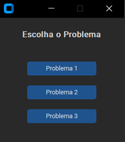
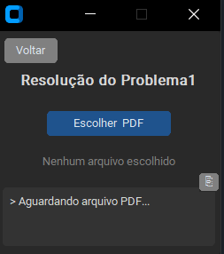

# 1. Descrição da aplicação

Um aplicativo simples para automatização de tarefas que envolvam tabelas em excel e pdf.
Faz transformações predefinidas e específicas e encerra sempre que algo dá minimante errado, para evitar corrupções e ações indesejadas.
# 2. Requisitos

## 2.1 Necessário:

* Windows 10 (Deve funcionar no Windows 11, mas eu não tenho esse ambiente para teste);
* [Excel](https://www.microsoft.com/pt-br/microsoft-365) instalado e ativado.

## 2.2 Para desenvolvedores:

* Python [3.11.14](https://www.python.org/downloads/release/python-31114/);
* [Git for Windows](https://git-scm.com/install/windows);
* Instale os módulos (em um `venv`):

```powershell
pip install pandas openpyxl xlwings nuitka zstandard camelot-py[all] customtkinter os pyinstaller
```

# 3. Como Instalar

No mundo ideal:
* Baixe o `app.exe` deste repositório, ele está no diretório `dist`;
* Execute o app.exe.
  
Caso haja algum problema na execução:

## 3.1 Use o terminal `Git Bash` para:

* Clonar este o repositório do GitHub:

```bash
git clone https://github.com/EttoreK/VG5107_Inova-o_Digital.git
```

## 3.2 Use o `cmd` para:

No diretório do `VG5107_Inova-o_Digital`.

### 3.2.1 Criar um `venv python`:

```powershell
python -m venv arcadis
```

### 3.2.2 Ativar o `venv`:

```powershell
arcadis\Scripts\activate
```

### 3.2.3  Rodar o compilador `pyinstaller`:

```powershell
pyinstaller --noconfirm --onefile --windowed --name "app" --collect-all customtkinter --collect-all xlwings --collect-all camelot --collect-all pandas app.py
```

* Alternativamente, pode usar o `Nuitka`. É muito mais lento, pois transforma todo o código para C e C++, porém cria resultados mais rápidos e leves (menos da metade do tamanho do arquivo).

```powershell
python -m nuitka --standalone --onefile --windows-console-mode=disable --enable-plugin=tk-inter --include-package=customtkinter --nofollow-import-to=pypdfium2_raw --remove-output --mingw64 app.py
```

### 3.2.4 Desativar o `venv`:

```powershell
deactivate
```

ou

```powershell
arcadis\Scripts\deactivate.bat
```

# 3.3 Local do executável

* Se foi usado o `pyinstaller`, será gerado o aplicativo em `.\dist\app.exe`
* Se foi usado o `nuitka`, será gerado na própria pasta `.\app.exe`

Agora é só executar, deve demorar um pouco para abrir.
# 4. Como Utilizar

Ao rodar o aplicativo, são exibidas 3 opções de problemas referente aos cases apresentados.

 

* Problema 1 – Processos de Automação para fontes de dados não editáveis
* Problema 2 – Processos de Tratamento de dados
* Problema 3 – Manipulação de dados

Clicando em qualquer uma delas é mostrado uma tela padrão, com o nome do problema escolhido e um botão Voltar para retornar à seleção.

O botão Escolher permite buscar um arquivo no explorador de arquivos e definir como arquivo de trabalho.

Para os problemas 1 e 3, o botão Escolher pede ao usuário, além de um arquivo (PDF ou EXCEL), um local para salvar o arquivo EXCEL de saída.

Já para o problema 2, cria uma nova planilha no arquivo escolhido e salva por cima. Por isso é importante que o arquivo esteja fechado para que o programa consiga salvar.

O texto de estado, logo abaixo do botão Escolher, mostra o arquivo de trabalho definido.

A caixa de texto no final da janela mostra os logs, em que etapa o arquivo está, da lógica de processamento.

O botão `⎘` permite copiar o log para a área de transferência. Assim fica fácil saber onde houve falha e pedir ajuda e suporte.